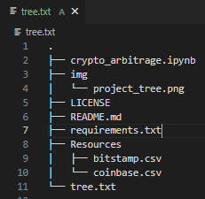

# <a id="Top-of-Page">Welcome to my Price Dislocation Analysis Tool!</a>
#### An analysis of arbitrage profitability throughout two Bitcoin exchanges.
***
## <a id="Contents">Cotents</a>
[Project Description](#Project-Description) 
[Technologies](#Technologies) 
[Installation Guide](#Installation-Guide) 
[Usage](#Usage) 
[Contributors](#Contributors) 
[License](#License) 
[Bottom of Page](#Bottom-of-Page) 
***
## Project Description<a id="Project-Description">
This project models automated price dislocation calculations to identify arbitrage oppotunities between two Bitcoin exchanges.

#### A summary of what's under the hood:
Using the Jupyter notebook, this tool sorts through historical trade data for Bitcoin on two exchanges: Bitstamp and Coinbase. By applying three phases of financial analysis, the tool will determine if any arbitrage opportunities exist for Bitcoin. The three phase include:
1. Collect the data.
2. Prepare the data.
3. Analyze the data.

#### Methods for identifying arbitrage opportunities:
Given this combination of provided and derived financials, we then determine the most suitable loans available by filtering on the following:

1. Measure the arbitrage spread between the two exchanges by subtracting the lower-priced exchange from the higher-priced one. Then use a conditional statement to generate the summary statistics for each arbitrage spread, where the spread is greater than zero.
2. Calculate the spread returns by dividing the instances that have a positive arbitrage spread (that is, a spread greater than zero) by the price of Bitcoin from the exchange we’re buying on (that is, the lower-priced exchange).
3. Determine the number of times the trades with positive returns exceed the 1% minimum threshold that you need to cover your costs.
4. Generate the summary statistics of the spread returns that are greater than 1%.
5. Calculate the potential profit, in dollars, per trade by multipling the spread returns that were greater than 1% by the cost of what was purchased.
    - We'll make sure to drop any missing values from the resulting DataFrame.
6. Generate the summary statistics and plot the results.
7. Calculate the potential arbitrage profits that can be made on each day.
8. Using the cumsum function, plot the cumulative sum.

#### Unit testing:
None required. 
    
#### Project layout:
The layout of essentials for this project is show below.

***
## Technologies<a id="Technologies">

<a href="https://docs.python.org/release/3.7.10/" title="https://docs.python.org/release/3.7.10/">
 
<a href="requirements.txt" title="requirements.txt">Requirements List</a>
***
## Installation Guide<a id="Installation-Guide">
<a href="https://github.com/jasonjgarcia24/price-dislocation" title="github.com/jasonjgarcia24/price-dislocation">price-dislocation</a> distribution in the works... 
    

***
## Usage<a id="Usage">
Observe price-dislocation with `crypto_arbitrage.ipynb`. No input variables are required in viewing the price-dislocation. 

***
## Contributors<a id="Contributors">
Currently just me :) 
***
## License<a id="License">
Each file included in this repository is licensed under the <a href="https://github.com/jasonjgarcia24/price-dislocation/blob/main/LICENSE" title="github.com/jasonjgarcia24/price-dislocation/blob/main/LICENSE">MIT License.</a>
***
[Top of Page](#Top-of-Page) 
[Contents](#Contents) 
[Project Description](#Project-Description) 
[Technologies](#Technologies) 
[Installation Guide](#Installation-Guide) 
[Usage](#Usage) 
[Contributors](#Contributors) 
[License](#License) 
