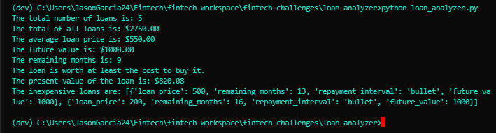
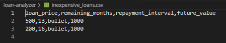

# <a id="Top-of-Page">Here is the loan-analyzer project!</a>
***
## <a id="Contents">Cotents:</a>
[Project Description](#Project-Description) 
[Technologies](#Technologies) 
[Installation Guide](#Installation-Guide) 
[Usage](#Usage) 
[Contributors](#Contributors) 
[License](#License) 
[Bottom of Page](#Bottom-of-Page) 
***
## <a id="Project-Description">Project Description</a>
This project provides automated calculations for loan portfolio summaries.

#### A summary of what's under the hood:
We start with some fundamental calculations on a list of prices for given loans.
1. The total number of loans provided will be calculated.
2. The total of all loans provided will be summed.
3. Using the sum of all loans and the total number of loans, the average loan price is calculated.
4. A summary of the calculations of interest will be printed.
***
## <a id="Technologies">Technologies</a>
<a href="https://docs.python.org/release/3.7.10/">

***
## <a id="Installation-Guide">Installation Guide</a>
<a href="https://github.com/jasonjgarcia24/fintech-analytics-toolbox">fintech-analytics-toolbox</a> distribution in the works... 
    

***
## <a id="Usage">Usage</a>
Run loan-analyzer with `python loan-analyzer.py`. No input variables are required, and the below image displays the expected terminal output: 

 

The expected .csv output is shown below: 

***
## <a id="Contributors">Contributors</a>
Currently just me :) 
***
## <a id="License">License</a>
Each file included in this repository is licensed under the <a href="https://github.com/jasonjgarcia24/fintech-analytics-toolbox/blob/main/LICENSE">MIT License.</a>
***
[Top of Page](#Top-of-Page) 
[Contents](#Contents) 
[Project Description](#Project-Description) 
[Technologies](#Technologies) 
[Installation Guide](#Installation-Guide) 
[Usage](#Usage) 
[Contributors](#Contributors) 
[License](#License) 
