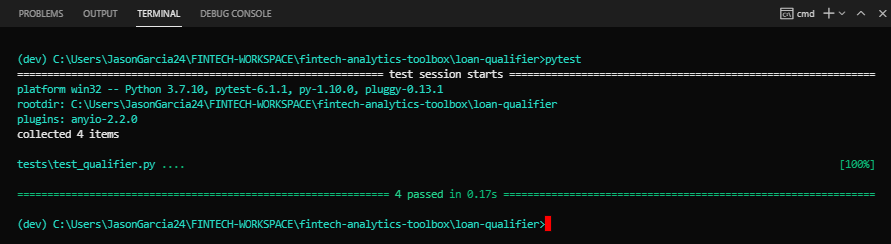
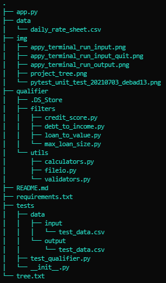
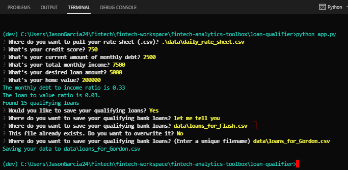
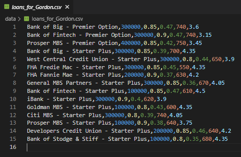
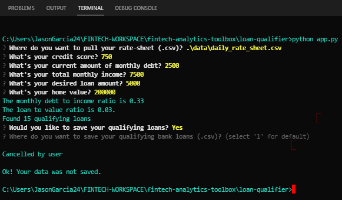

# Here is the loan-qualifier project!<a id="Top-of-Page">
***
## <a id="Contents">Cotents</a>
[Project Description](#Project-Description) 
[Technologies](#Technologies) 
[Installation Guide](#Installation-Guide) 
[Usage](#Usage) 
[Contributors](#Contributors) 
[License](#License) 
[Bottom of Page](#Bottom-of-Page) 
***
## Project Description<a id="Project-Description">
This project provides automated calculations to identify qualifying loans.

#### A summary of what's under the hood:
Using the loan qualifier command-line interface (CLI), this tool queries for necessary financial information to best match qualifying loans. Once the requested information has been collected, the tool will generate a list of qualifying loans based off of the provided financials. Via the CLI, the user can then perform their preferred action with the results. The available actions are summarized below:
 - When the user chooses to save the loans, the tool will prompt for a file path to save the list.
 - When prompted to save the results, the user can opt out of saving the file.
 - When the user chooses to save the loans, the tool will save the results as a CSV file.
 - If the user enters a file name for an existing file, the CLI will notify the user and ask if they want to overwrite it.
     - If YES, the previous file is overwritten.
     - If NO, the user must enter a unique file name from here on out.
 - If there are no qualifying loans, the qualifier program will notify the user and exit, given there is nothing to save.
    
#### Provided financials:
In order to best determine the suitable loans, the tool will query several financials from the user via the CLI. These financials include:
1. Current credit score
2. Total amount of monthly debt
3. Total monthly income
4. Desired loan amount
5. Current home value

#### Derived financials:
We then start with some fundamental calculations on the provided financials, which include:
1. Monthly debt to income ratio (DTI)
2. Loan to value ratio (LTV)

#### Methods for creating list of qualifying loans:
Given this combination of provided and derived financials, we then determine the most suitable loans available by filtering on the following:
1. Available loans given the requested amount
2. Available loans given the provided credit score
3. Available loans given the derived DTI
4. Available loans given the derived LTV

Using the above tools for identifying suitable loans, a list of loans meeting all conditions is then provided!

#### Unit testing:
Unit testing is performed on all modules contained within the loan-qualifier project.  
To perform unit testing, at the root path run `pytest tests` or simply `pytest`. Below is the current status of running this checkout. 
    

#### Project layout:
The layout of essentials for this project is show below.

***
## Technologies<a id="Technologies">
<a href="https://docs.python.org/release/3.7.10/">

 
<a href="requirements.txt" title="requirements.txt">Requirements List</a>
***
## Installation Guide<a id="Installation-Guide">
<a href="https://github.com/jasonjgarcia24/fintech-analytics-toolbox" title="github.com/jasonjgarcia24/fintech-analytics-toolbox">fintech-analytics-toolbox</a> distribution in the works... 
    

***
## Usage<a id="Usage">
Run loan-analyzer with `python app.py`. No input variables are required in calling loan-qualifier app, however user CLI inputs are required. The below image displays the expected terminal prompts with user inputs. 

 

The expected .csv output is shown below. 

  

At any CLI query, the user can choose to exit the tool using <code>Ctrl + C</code>.

***
## Contributors<a id="Contributors">
Currently just me :) 
***
## License<a id="License">
Each file included in this repository is licensed under the <a href="https://github.com/jasonjgarcia24/fintech-analytics-toolbox/blob/main/LICENSE" title="github.com/jasonjgarcia24/fintech-analytics-toolbox/blob/main/LICENSE">MIT License.</a>
***
[Top of Page](#Top-of-Page) 
[Contents](#Contents) 
[Project Description](#Project-Description) 
[Technologies](#Technologies) 
[Installation Guide](#Installation-Guide) 
[Usage](#Usage) 
[Contributors](#Contributors) 
[License](#License) 
